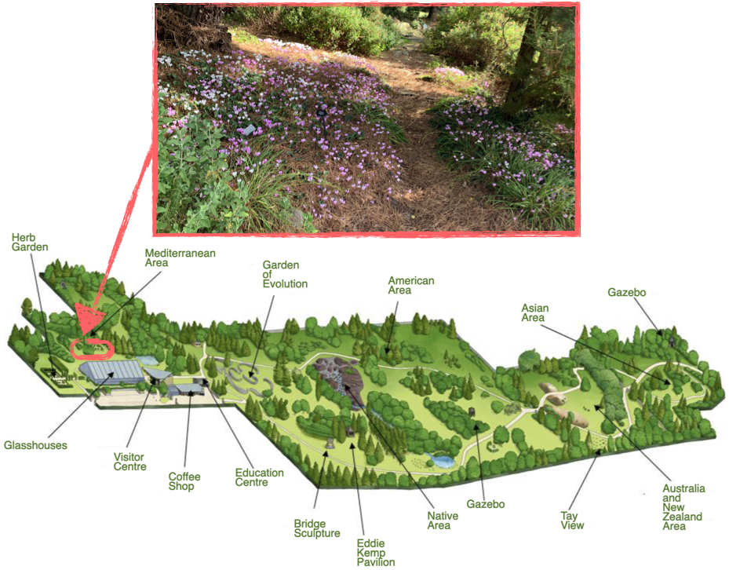
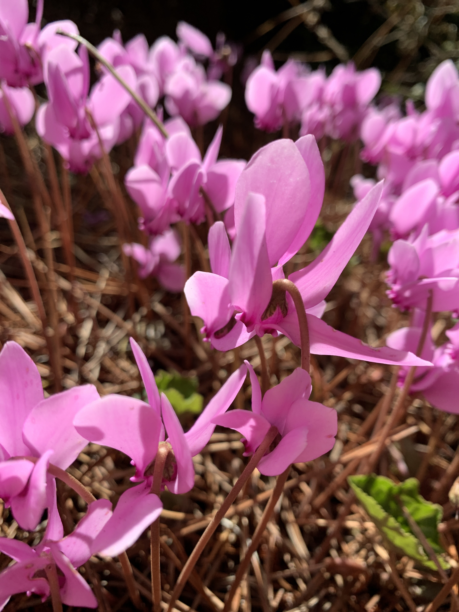
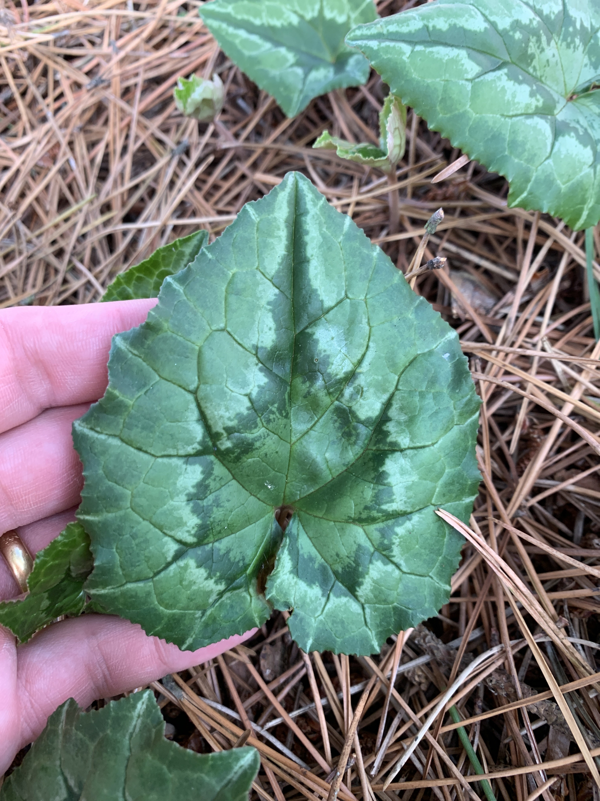
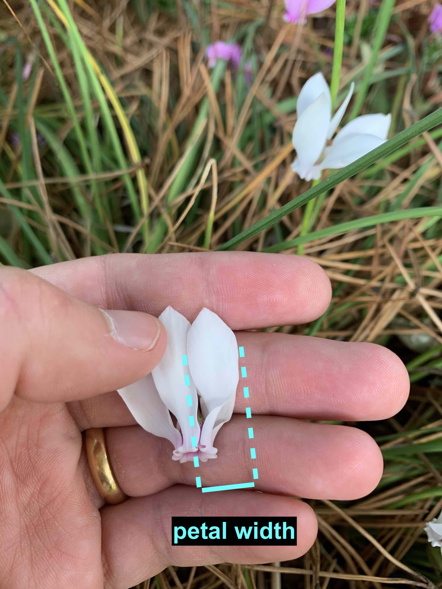
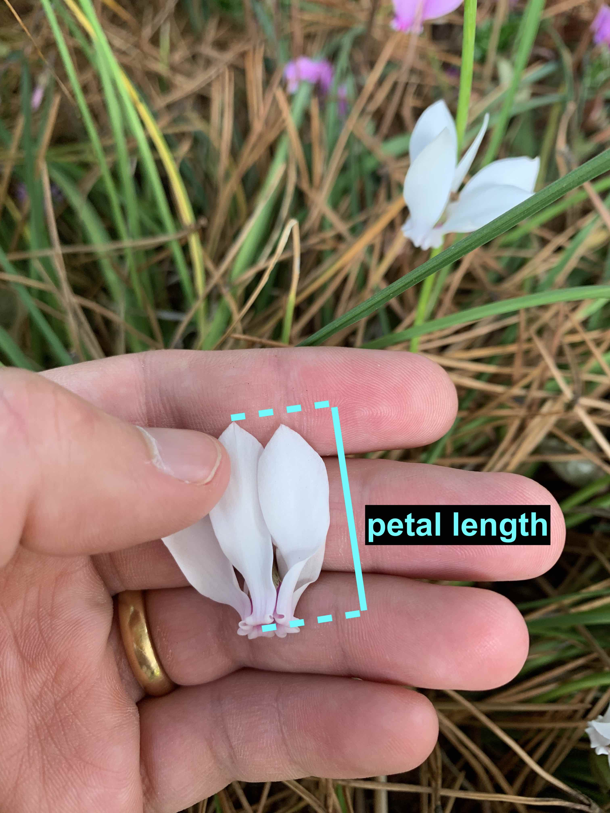
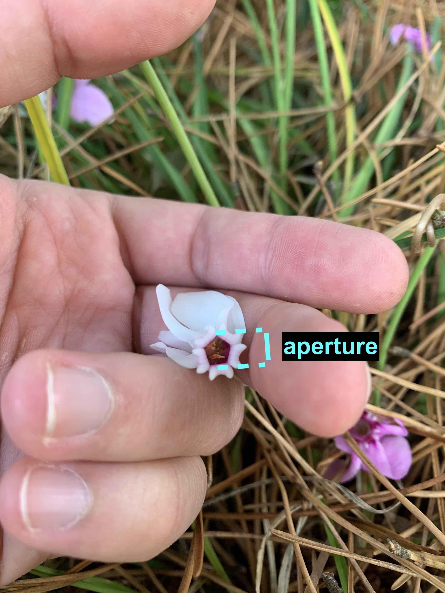

# Overview 

Please read this document before the workshop. Items with a checkbox require your action. This learning activity will take place at the University Botanic Garden.^[Campus map: [https://app.dundee.ac.uk/campusmap/?location=BOTANIC_GARDEN](https://app.dundee.ac.uk/campusmap/?location=BOTANIC_GARDEN). Address: Botanic Garden, Burnaby Street, University of Dundee, Dundee, DD2 1QH.] The activity is timetabled as a three-hour class ("field trip") on **Wednesday, 1 October 2025, from 10:00--13:00**, however, the **activity will start at 11:00 and will take approximately 60 minutes to complete**; this is to ensure sufficient time to travel between the main campus and the Botanic Garden.

## Be Prepared 

Please come prepared for your visit to the Botanic Gardens.

- [ ] Know what group (Alpha, Beta, Gamma, etc.) you are in by checking MyDundee.
- [ ] Bring a metric ruler with mm subdivisions.^[About three rulers or callipers per group is sufficient.]
- [ ] Bring paper and pen(cil).
- [ ] Bring your student ID card (for free access to the Gardens).

## Working in Groups

You have each been assigned to work in a small group with fellow students. Please be respectful by participating in the workshop and completing the tasks. 

- [ ] Please read §7 Teamwork of the class notes and familiarise yourself with the "Code of conduct for group work".
- [ ] Please consider taking a photo of your group working together at the Gardens and include it with your data submission.

## Specimen of interest

You will be taking measurements of *Cyclamen hederifolium* (cyclamen). Clumps of cyclamen can be found in the wooded areas to the north of the glasshouses, i.e., heading in the direction of the Mediterranean Area. Please see the map in @fig-map.

{#fig-map width="80%"}

As shown in @fig-cyclamen, Cyclamen flowers and leaves have unusual features that aid identification. Flowers are small, downward-opening bells with reflexed petals in shades of white (var. *hederifolium* forma *albiflorum*) or pink (var. *hederifolium* forma *hederifolium*). Leaves are shallowly lobed with scalloped edges and are typically green with a silver-grey hastate pattern. 

::: {.content-visible when-format="pdf"}
::: {#fig-cyclamen fig-cap="A clump of pink cyclamen with reflexed petals (left) and a green cyclamen leaf with silver-grey hastate pattern (right)."}
```{=latex}
\begin{minipage}[t]{.4\linewidth}
  \centering
  \includegraphics[width=\linewidth]{assets/images/IMG_7072.JPG}
\end{minipage}
\begin{minipage}[t]{.4\linewidth}
  \centering
  \includegraphics[width=\linewidth]{assets/images/IMG_7071.JPG}
\end{minipage}
```
:::
:::

::: {.content-visible when-format="html"}
::: {#fig-cyclamen layout-ncol=2 fig-cap="A clump of pink cyclamen with reflexed petals (left) and a green cyclamen leaf with silver-grey hastate pattern (right)."}


:::
:::

# Accuracy and Precision

Understanding the quality of your measurements matters just as much as collecting them.

## Key ideas

:::{.callout-important icon="false"}
## Random vs systematic error

Random errors vary from one measurement to the next and set your _precision_; systematic errors are consistent offsets (e.g., mis-zeroed ruler) and affect _accuracy_. A result is *precise* when random error is small, and *accurate* when it is relatively free of systematic error. 
:::

:::{.callout-important icon="false"}
## Normal (Gaussian) uncertainty

If repeated readings scatter normally with standard deviation $\sigma$, there's \~67% chance the true value lies within $\pm\sigma$ and \~95% within $\pm2\sigma$. When comparing two values, check whether their uncertainty ranges overlap before claiming a difference.
:::

## How to read instruments and what to record

### Rulers / linear scales {-}

For any analogue measuring device, the resolution is set by the smallet marked division on its scale. Since the true value may fall anywhere between two markings, the reading is usually taken to the nearest division, giving an uncertainty of about $\pm$ half the smallest scale division.

When using a ruler, the smallest division is typically $1\,\mathrm{mm}$, so the actual length can only be estimated within half that interval. This means every measurement carries an uncertainty of about $\pm0.5\,\mathrm{mm}$ due to the ruler's limited resolution.

### Digital displays (balances/meters) {-} 

Record every shown digit (including trailing zeros). The uncertainty is often $\sim \pm 1$ unit in the last displayed digit unless the instrument specification says otherwise.

### Systematic checks {-} 

Before measuring, check for bent rulers, parallax^[Displacement or difference in aparent position when viewed along two different lines of sight - if the eye is not directly above the measurement mark, the reading will shift slightly], or zero offsets (the zero mark may be worn or shifted - the best practice is to start from the $1\,\mathrm{cm}$ line and subtract $1\,\mathrm{cm}$ at the end); if a known systematic offset (magnitude and sign) exists, then correct the reading rather than incorporating it into the random error.


## Significant figures: Quoting results sensibly

Report a measurement as a value plus/minus uncertainty, and match the decimal place of the value to the rounded uncertainty. Round the uncertainty to one significant figure (use two if it begins with "1").

:::{.callout-note}
## Examples

- $12.347\,\mathrm{mm}$ with an uncertainty of $0.35\,\mathrm{mm}$ becomes $12.3 \pm 0.4\,\mathrm{mm}$.

- $101.053\pm 0.12 \longrightarrow 101.05 \pm 0.12$ (uncertainty starts with 1 → 2 s.f.; value to hundredths).

- $0.0492 \pm 0.012 \longrightarrow 0.049 \pm 0.012$ (uncertainty starts with 1 → 2 s.f.; value to thousandths).

Note: Exact counts/constants (e.g., 2, 10, $\pi$) don't limit significant figures. Avoid premature rounding in intermediate steps; round only at the end.
:::

Scientific notation clarifies trailing zeros and how many significant figures you intend (e.g., $2.00\times10^3$ has 3 s.f.). Calculators don't know sig-fig rules --- _you_ must apply them. If uncertainties are known, propagate them and then round (to the uncertainty's decimal place). If uncertainties are not known:
- Multiplication/division: limit by the *fewest* significant figures among inputs.
- Addition/subtraction: limit by the *fewest decimal places* among inputs.


## Propagating uncertainty (quick rules you can use in the field)

Suppose we wish to calculate a quantity, 
$$Z = f(A, B, C, \dots)\,,$$ 
which is a function of measurements $A, B, C, \dots$ with uncertanties $\Delta A, \Delta B, \Delta C, \dots$, i.e., 
$$A\pm \Delta A, \; B \pm \Delta B,\; C \pm \Delta C,\; \dots\,.$$ 
For small, independent random uncertainties, to find $\Delta Z$, the uncertainty in $Z$, one "adds in quadrature" of the sensitivities:
$$(\Delta Z)^2 \approx \left(\frac{\partial f}{\partial A} \Delta A \right)^2 + \left(\frac{\partial f}{\partial B} \Delta B \right)^2 + \cdots \,.$$

Two quick and conservative estimates for propagating uncertainty based on this rule are as follows. 
For sums/differences:
$$Z = A \pm B \pm C \pm \cdots \,,$$ 
then absolute uncertainties add,
  $$\Delta Z \approx \Delta A + \Delta B + \Delta C  + \cdots \,.$$
For products/quotients/powers: 
$$Z = k\,A^n B^m \dots\,,$$
fractional uncertainties add with exponents,
$$\dfrac{\Delta Z}{Z} \approx |n|\dfrac{\Delta A}{A} + |m|\dfrac{\Delta B}{B} + \cdots \,.$$
Note that both of these formulas above are _conservative_ estimates. 

To combine random with systematic uncertainty, we consider two cases. If only magnitudes are known, then add in quadrature (root-sum-of-squares). If the systematic bias is known in sign and magnitude, correct for it instead of combining.


# Data Collection Activity {#sec-collection}

- [ ] As a group, please collect and record measurements from approximately 40-60 cyclamen flowers. Details on methodology and record-keeping follow below. 

## Methodology

### Collection {-}

Please randomly choose specimens (flowers) from several different clumps (plants). Record one complete set of measurements from each specimen. Please don't trample the flowers! 

### Measurements {-}

For each specimen, you will take a series of measurements (see @fig-meas):

- **petal width**: width (measured in millimetres) at the widest point for a *single petal* from the specimen,
- **petal length**: length (measured in millimetres) at the longest point for a *single petal* from the specimen,
- **aperture**: inner diameter (measured in millimetres) of the bell opening from which petals fold back, and 
- **colour**: the specimen's colour, either *pink* or *white*. 

::: {.content-visible when-format="pdf"}
::: {#fig-meas fig-cap="How to measure the petal width (left), petal length (center), and aperture diameter (right) for a white cyclamen specimen."}
```{=latex}
\begin{minipage}[t]{.32\linewidth}
  \centering
  \includegraphics[width=\linewidth]{assets/images/petal.width.jpg}
\end{minipage}\hfill
\begin{minipage}[t]{.32\linewidth}
  \centering
  \includegraphics[width=\linewidth]{assets/images/petal.length.jpg}
\end{minipage}\hfill
\begin{minipage}[t]{.32\linewidth}
  \centering
  \includegraphics[width=\linewidth]{assets/images/aperture.jpg}
\end{minipage}
```
:::
:::

::: {.content-visible when-format="html"}
::: {#fig-meas layout-ncol=3 fig-cap="How to measure the petal width (left), petal length (center), and aperture diameter (right) for a white cyclamen specimen."}



:::
:::

## Record-keeping

Create a _machine readable_ data table of your observations using, e.g., Excel, Google Sheets, or a simple CSV^[comma-separated values] file. You can either record observations directly while or transcribe afterwards.


:::{.callout-note} 
## Example

Each measurement or *variable* corresponds to a column in your data table. Observations for each specimen (flower) correspond to one row in your data table. For example:

```{r}
#| label: eg
#| echo: false
#| warning: false
#| message: false
library(tidyverse)
library(kableExtra)
library(readr)
kbl(tibble(read_csv("data/eg.csv")), longtable = TRUE, booktabs = TRUE) |>
  kable_styling(latex_options = c("striped", "repeat_header"),
  font_size = 8)
```
:::


# Exploratory Data Analysis Activity {#sec-analysis}

## Descriptive statistics and propagating uncertainty

- [ ] Please explore your team's data by describing the distribution, central tendency (mean, median, and mode), and variability for variables in your data set. For example, produce a five-number summary, a box and whisker plot (or boxplot), a stem and leaf diagram, and/or a histogram.
- [ ] When deriving new quantities (e.g., ratios), estimate the propagated uncertainty with the rules contained in this lab handout. 

This task can be completed using `R`, `python`, Excel, or any calculator. 

## Discussion

- [ ] Please discuss your analysis with your group. Please takes notes summarising your findings; these may inform your lab report. 

:::{.callout-tip}
## Things you may wish to consider

- What are sources of random error? What are sources of systematic error?
- Are apparent differences larger than the combined uncertainties (e.g., look at overlapping ranges)? 
- What tools were used to analyse the data?
- Did each analysis explore the same features of the data?
- What variables did your analysis consider?
- What descriptive statistics were used in your analysis?
- Were descriptive statistics and plots produced across your team consistent? 
:::

## Write-up

- [ ] Having collected data as a group, please write up individually a summary containing your findings (i.e., a lab report). See §8 Technical Writing of the notes for a short guide on writing, and follow the structure for the report:
    - [ ] Title and Introduction (give a descriptive title and state the purpose of the trip)
    - [ ] Methods (describe how measurements were taken; make it clear enough that someone else can repeat your work)
    - [ ] Results (present the data clearly, including uncertaintites)
    - [ ] Discussion (interpret the results)
    - [ ] Conclusion (summarise the key findings and reflect on what was learnt from the trip)
    - [ ] References (cite any background sources - textbooks, botanic garden information, and/or articles)
- [ ] Bring your lab report to the next problem solving class on Wednesday, 8 October 2025, for a peer-review activity considering _Technical Writing Rubric_ (see Appendix A of the notes).
- [ ] Adopt a growth mindset: peer-review feedback will only be used for formative assessment (your summative Peer Review Portfolio grade will be based on engaging as a reviewee and reviewer).


::: {.filehistorybottom}
Dr Eric Hall (ehall001@dundee.ac.uk), last updated: `{r} format(Sys.time(), '%Y-%m-%d')`, commit: `r substr(git2r::branch_target(git2r::repository_head(getwd())), 1, 10)`. 
:::
