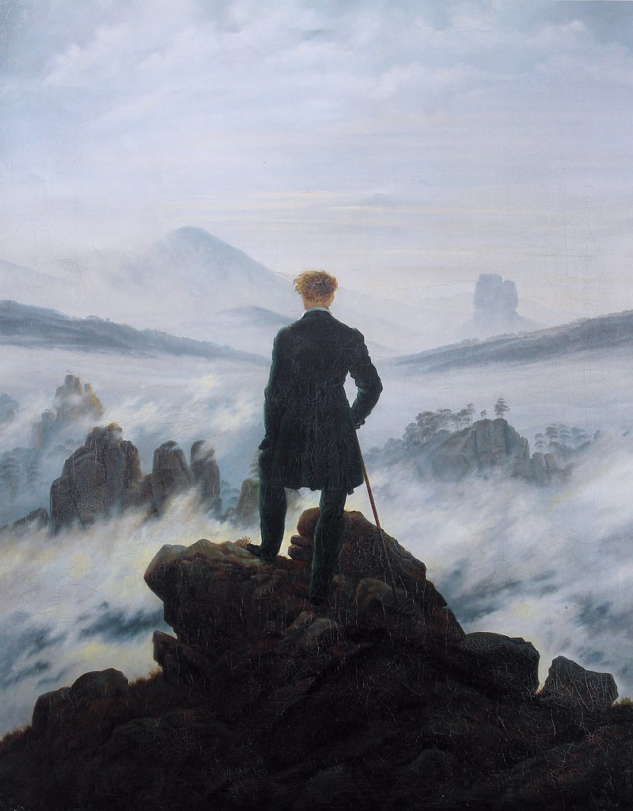



# Introduction {-}

:::{.content-visible only-format="pdf"}
This manuscript contains notes for PH11002, a first year module for mathematics and physics students about problem solving and professional skills at the University of Dundee.
:::

An up-to-date version of these notes are available at [dundeemath.github.io/PH11002/](https://dundeemath.github.io/PH11002/) as HTML and also as a PDF. 

:::{.content-visible when-format="html"}
The painting _Der Wanderer über dem Nebelmeer_ (Wanderer above the Sea of Fog) by Caspar David Friedrich, c. 1818, is part of the collection of the Hamburger Kunsthalle, Hamburg. 

"The hiker stands as a back figure in the center of the composition. He looks down on an almost impenetrable sea of fog in the midst of a rocky landscape - a metaphor for life as an ominous journey into the unknown."[^sea-fog] 

[^sea-fog]: [https://commons.wikimedia.org/wiki/File:Caspar_David_Friedrich_-_Wanderer_above_the_Sea_of_Fog.jpeg](https://commons.wikimedia.org/wiki/File:Caspar_David_Friedrich_-_Wanderer_above_the_Sea_of_Fog.jpeg)
:::

:::{.content-visible when-format="pdf"}
\bigskip 
\bigskip
<!-- {width=40%} -->
\begin{wrapfigure}{r}{0.4\textwidth}
\vspace{-1.0\baselineskip}
\centering
\includegraphics[width=.8\linewidth]{assets/images/cover_small.jpg}
\end{wrapfigure}

The painting _Der Wanderer über dem Nebelmeer_ (Wanderer above the Sea of Fog) by Caspar David Friedrich, c. 1818, is part of the collection of the Hamburger Kunsthalle, Hamburg.[^sea-fog]

"The hiker stands as a back figure in the center of the composition. He looks down on an almost impenetrable sea of fog in the midst of a rocky landscape - a metaphor for life as an ominous journey into the unknown."
\bigskip

[^sea-fog]: [https://commons.wikimedia.org/wiki/File:Caspar_David_Friedrich_-_Wanderer_above_the_Sea_of_Fog.jpeg](https://commons.wikimedia.org/wiki/File:Caspar_David_Friedrich_-_Wanderer_above_the_Sea_of_Fog.jpeg)

\section*{Publication data}

First published 2025-09-20
<!-- Updated  -->

\bigskip
Authors: 

Dr Eric Hall, University of Dundee

Dr Paula Stella Teixeira, University of Dundee

\bigskip 
:::

Any questions or comments about these notes can be directed to Dr Eric Hall ([ehall001@dundee.ac.uk](mailto:ehall001@dundee.ac.uk)).


```{=latex}
\vfill
```

## Licence

{alt="Creative Commons License" style="float:left;padding-right:30px;border-width:0"}

This work is licensed under a [Creative Commons Attribution-NonCommercial 4.0 International License](http://creativecommons.org/licenses/by-nc/4.0/).

:::{.content-visible when-format="pdf"}
Copyright 2025, Eric Hall (University of Dundee).
:::
